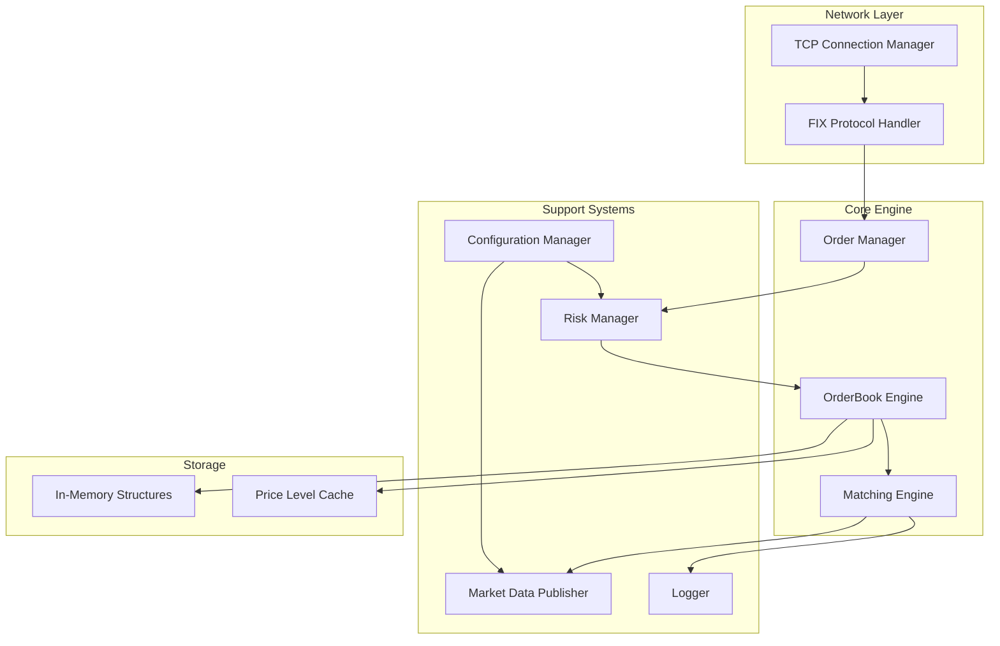

# Design Document

## Overview

This design document outlines the technical approach for refactoring the existing orderbook implementation to resolve critical architectural issues while maintaining high-performance characteristics. The refactored system will provide a unified, production-ready orderbook with complete matching logic, FIX protocol support, risk management, and market data publishing.

The design addresses the identified problems: type inconsistencies, template/non-template confusion, missing dependencies, incomplete implementation, and build system issues. The solution emphasizes performance, maintainability, and extensibility while ensuring the system can handle 500,000+ orders per second with sub-50μs latency.

## Architecture

### High-Level Architecture



### Design Principles

1. **Single Responsibility**: Each component has a clear, focused purpose
2. **Performance First**: All design decisions prioritize low-latency execution
3. **Type Safety**: Strong typing prevents runtime errors and improves maintainability
4. **Memory Efficiency**: Contiguous memory layout and minimal allocations
5. **Testability**: Components are loosely coupled and easily testable

## Components and Interfaces

### 1. Type System Unification

**Problem Resolution**: Eliminate conflicting type definitions across headers.

**Solution**: Create a single `Types.hpp` with all core type definitions:

```cpp
namespace orderbook {
    // Strong type for Order IDs
    struct OrderId {
        uint64_t value;
        explicit constexpr OrderId(uint64_t id) : value(id) {}
        constexpr operator uint64_t() const { return value; }
    };
    
    // Template-friendly type aliases
    using Price = double;
    using Quantity = uint64_t;
    using Timestamp = std::chrono::system_clock::time_point;
    
    // Enums
    enum class Side : uint8_t { Buy, Sell };
    enum class OrderType : uint8_t { Limit, Market };
    enum class TimeInForce : uint8_t { GTC, IOC, FOK };
}
```

### 2. Unified OrderBook Design

**Problem Resolution**: Choose single implementation approach (non-templated for simplicity).

**Solution**: Non-templated OrderBook with optimized data structures:

```cpp
class OrderBook {
public:
    // Core operations
    OrderResult addOrder(const Order& order);
    CancelResult cancelOrder(OrderId id);
    ModifyResult modifyOrder(OrderId id, Price new_price, Quantity new_quantity);
    
    // Market data queries
    std::optional<Price> bestBid() const;
    std::optional<Price> bestAsk() const;
    MarketDepth getDepth(size_t levels) const;
    
private:
    // Optimized storage
    std::vector<PriceLevel> bids_;
    std::vector<PriceLevel> asks_;
    std::unordered_map<Price, PriceLevel*> price_index_;
    std::unordered_map<OrderId, OrderLocation> order_index_;
    
    // Dependencies
    std::unique_ptr<RiskManager> risk_manager_;
    std::unique_ptr<MarketDataPublisher> market_data_;
    std::unique_ptr<Logger> logger_;
};
```

### 3. Complete Matching Engine

**Problem Resolution**: Implement full order matching logic with trade execution.

**Solution**: Dedicated MatchingEngine component:

```cpp
class MatchingEngine {
public:
    struct MatchResult {
        std::vector<Trade> trades;
        std::optional<Order> remaining_order;
        bool fully_filled;
    };
    
    MatchResult matchOrder(const Order& incoming_order, OrderBook& book);
    
private:
    TradeId generateTradeId();
    void executeTrade(const Order& buy_order, const Order& sell_order, 
                     Price price, Quantity quantity);
};
```

### 4. Risk Management Integration

**Problem Resolution**: Add missing risk controls with configurable limits.

**Solution**: RiskManager with pre-trade validation:

```cpp
class RiskManager {
public:
    enum class RiskResult { Approved, Rejected };
    
    struct RiskCheck {
        RiskResult result;
        std::string reason;
    };
    
    RiskCheck validateOrder(const Order& order, const Portfolio& portfolio);
    void updatePosition(const Trade& trade);
    
private:
    struct RiskLimits {
        Quantity max_order_size;
        Price max_price;
        int64_t max_position;
    } limits_;
    
    std::unordered_map<std::string, Portfolio> portfolios_;
};
```

### 5. Market Data Publishing

**Problem Resolution**: Add real-time market data distribution.

**Solution**: Event-driven MarketDataPublisher:

```cpp
class MarketDataPublisher {
public:
    void publishTrade(const Trade& trade);
    void publishBookUpdate(const BookUpdate& update);
    void publishBestPrices(Price bid, Price ask);
    
    void subscribe(std::shared_ptr<MarketDataSubscriber> subscriber);
    
private:
    std::vector<std::weak_ptr<MarketDataSubscriber>> subscribers_;
    SequenceNumber sequence_;
};
```

### 6. FIX Protocol Implementation

**Problem Resolution**: Complete the network layer with proper FIX 4.4 support.

**Solution**: Async FIX session management:

```cpp
class FixSession {
public:
    void start(const std::string& host, uint16_t port);
    void sendExecutionReport(const ExecutionReport& report);
    void setOrderHandler(std::function<void(const NewOrderSingle&)> handler);
    
private:
    boost::asio::io_context io_context_;
    boost::asio::ip::tcp::socket socket_;
    FixMessageParser parser_;
    SequenceNumber incoming_seq_;
    SequenceNumber outgoing_seq_;
};
```

## Data Models

### Core Data Structures

```cpp
// Optimized order representation
struct Order {
    OrderId id;
    Side side;
    OrderType type;
    TimeInForce tif;
    Price price;
    Quantity quantity;
    Quantity filled_quantity = 0;
    std::string symbol;
    std::string account;
    Timestamp timestamp;
    
    // Linked list pointers for price level
    Order* next = nullptr;
    Order* prev = nullptr;
};

// Price level with order queue
struct PriceLevel {
    Price price;
    Quantity total_quantity = 0;
    size_t order_count = 0;
    Order* head = nullptr;
    Order* tail = nullptr;
    
    void addOrder(Order* order);
    void removeOrder(Order* order);
};

// Trade execution record
struct Trade {
    TradeId id;
    OrderId buy_order_id;
    OrderId sell_order_id;
    Price price;
    Quantity quantity;
    Timestamp timestamp;
    std::string symbol;
};

// Order location for fast lookup
struct OrderLocation {
    Order* order;
    PriceLevel* price_level;
    Side side;
};
```

### Memory Layout Optimization

- **Price Levels**: Stored in `std::vector` with best prices at ends (no shifting)
- **Orders**: Custom doubly-linked list within price levels (no std::list overhead)
- **Alignment**: 128-byte aligned structures for SIMD operations
- **Pre-allocation**: Reserve capacity based on expected load

## Error Handling

### Error Categories

1. **Validation Errors**: Invalid order parameters, risk violations
2. **System Errors**: Memory allocation failures, network issues
3. **Protocol Errors**: Malformed FIX messages, sequence number gaps
4. **Configuration Errors**: Missing config files, invalid parameters

### Error Handling Strategy

```cpp
// Result types for error propagation
template<typename T>
class Result {
public:
    static Result success(T value);
    static Result error(const std::string& message);
    
    bool isSuccess() const;
    const T& value() const;
    const std::string& error() const;
    
private:
    std::variant<T, std::string> data_;
};

// Specific result types
using OrderResult = Result<OrderId>;
using CancelResult = Result<bool>;
using ModifyResult = Result<Order>;
```

### Logging Integration

- **Structured Logging**: JSON format for machine parsing
- **Performance Logging**: Separate high-frequency performance metrics
- **Error Context**: Include relevant order/trade information in error logs
- **Log Levels**: Configurable verbosity (DEBUG, INFO, WARN, ERROR)

## Testing Strategy

### Unit Testing

- **Component Isolation**: Mock dependencies for focused testing
- **Performance Tests**: Latency and throughput benchmarks
- **Edge Cases**: Boundary conditions, error scenarios
- **Memory Tests**: Leak detection, allocation patterns

### Integration Testing

- **End-to-End Flows**: Order lifecycle from FIX message to execution
- **Multi-Component**: OrderBook + RiskManager + MarketData integration
- **Network Testing**: FIX protocol compliance, connection handling
- **Configuration Testing**: Various config scenarios

### Performance Testing

- **Latency Benchmarks**: Measure order processing times
- **Throughput Tests**: Sustained load testing
- **Memory Profiling**: Allocation patterns and cache efficiency
- **Stress Testing**: High-load scenarios, resource exhaustion

### Demo Application Testing

- **Scenario Coverage**: All order types and operations
- **Output Validation**: Verify demo displays correct information
- **Performance Display**: Ensure metrics are accurate
- **Recording Quality**: Validate output is suitable for recording

## Build System Design

### CMake Structure

```cmake
# Modern CMake with proper dependency management
cmake_minimum_required(VERSION 3.15)
project(OrderBook VERSION 1.0.0 LANGUAGES CXX)

# C++17 with optimizations
set(CMAKE_CXX_STANDARD 17)
set(CMAKE_CXX_STANDARD_REQUIRED ON)
add_compile_options(-O3 -march=native -DNDEBUG)

# Find dependencies
find_package(Boost 1.70 REQUIRED COMPONENTS system)
find_package(Threads REQUIRED)

# Library targets
add_library(OrderBookCore STATIC ${CORE_SOURCES})
add_library(OrderBookNetwork STATIC ${NETWORK_SOURCES})
add_library(OrderBookUtils STATIC ${UTILITY_SOURCES})

# Main executable
add_executable(OrderBook src/main.cpp)
target_link_libraries(OrderBook PRIVATE 
    OrderBookCore 
    OrderBookNetwork 
    OrderBookUtils
    Boost::system 
    Threads::Threads
)

# Demo executable
add_executable(OrderBookDemo src/demo.cpp)
target_link_libraries(OrderBookDemo PRIVATE OrderBookCore)
```

### Dependency Management

- **Boost**: Asio for networking, system utilities
- **Threading**: std::thread for async operations
- **Testing**: Catch2 or Google Test framework
- **Benchmarking**: Google Benchmark for performance tests

## Performance Optimizations

### Memory Optimizations

1. **Object Pooling**: Reuse Order and Trade objects
2. **Custom Allocators**: Stack allocators for temporary objects
3. **Memory Mapping**: Pre-allocated memory regions
4. **Cache-Friendly Layout**: Minimize cache misses

### CPU Optimizations

1. **Branch Prediction**: Likely/unlikely hints for hot paths
2. **SIMD Instructions**: Vectorized operations where applicable
3. **Lock-Free Structures**: Atomic operations for thread safety
4. **Compile-Time Constants**: Template specialization for known values

### Network Optimizations

1. **Zero-Copy**: Minimize data copying in network layer
2. **Batching**: Group multiple messages for efficiency
3. **Connection Pooling**: Reuse network connections
4. **Async I/O**: Non-blocking network operations

This design provides a comprehensive solution to all identified issues while maintaining the high-performance characteristics required for a production trading system.